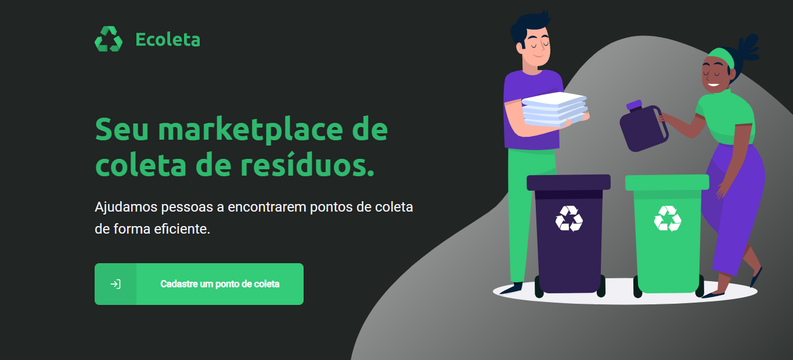

## Sobre o projeto

trata-se de uma aplicação de gerenciamento de resíduos, onde as empresas podem encontrar locais de deposito.

## Tecnologias utilizadas

* [NodeJS](https://nodejs.org/en/)
* [ReactJS](https://reactjs.org/)
* [React Native](https://reactnative.dev/)
